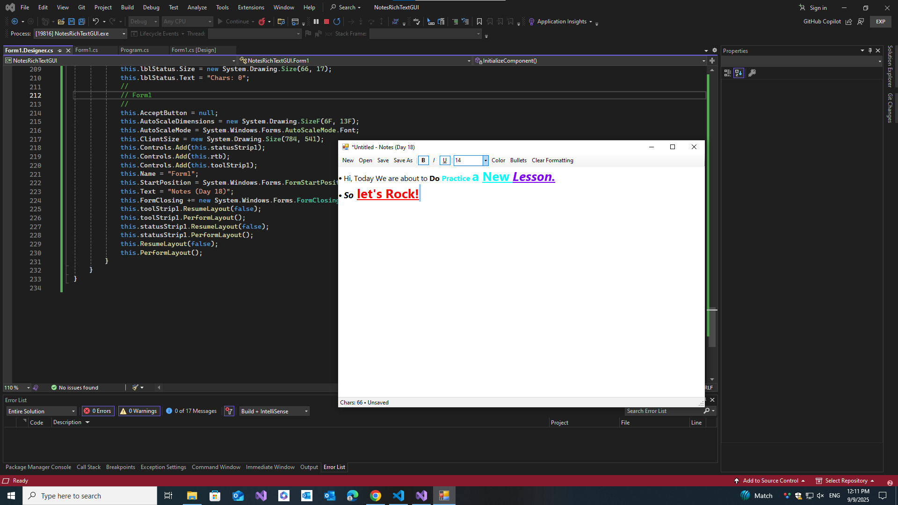

# 📝 Notes (Rich Text) – C# WinForms

**Day 18** of my 30-Day C# plan.  
A lightweight **rich text editor** with basic formatting and file I/O.

## Features
- New / Open / Save / Save As
- Rich formatting: **Bold, Italic, Underline**, **Font size**, **Text color**
- **Bulleted lists** and **Clear formatting**
- Unsaved-changes prompt, status bar with char count

---

#### 📸 Screenshots

| 📝 | 
|--------------|
|  |
